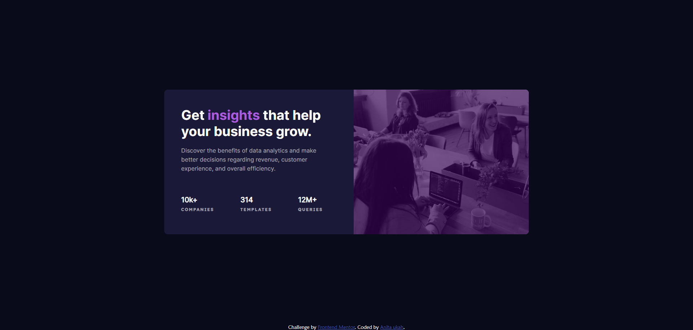

# Frontend Mentor - Stats preview card component solution

This is a solution to the [Stats preview card component challenge on Frontend Mentor](https://www.frontendmentor.io/challenges/stats-preview-card-component-8JqbgoU62). Frontend Mentor challenges help you improve your coding skills by building realistic projects. 

## Table of contents

- [Overview](#overview)
  - [The challenge](#the-challenge)
  - [Screenshot](#screenshot)
  - [Links](#links)
- [My process](#my-process)
  - [Built with](#built-with)
  - [What I learned](#what-i-learned)
  - [Continued development](#continued-development)
  - [Useful resources](#useful-resources)
- [Author](#author)
- [Acknowledgments](#acknowledgments)

**Note: Delete this note and update the table of contents based on what sections you keep.**

## Overview

### The challenge

Users should be able to:

- View the optimal layout depending on their device's screen size

### Screenshot



Add a screenshot of your solution. The easiest way to do this is to use Firefox to view your project, right-click the page and select "Take a Screenshot". You can choose either a full-height screenshot or a cropped one based on how long the page is. If it's very long, it might be best to crop it.

Alternatively, you can use a tool like [FireShot](https://getfireshot.com/) to take the screenshot. FireShot has a free option, so you don't need to purchase it. 

Then crop/optimize/edit your image however you like, add it to your project, and update the file path in the image above.

**Note: Delete this note and the paragraphs above when you add your screenshot. If you prefer not to add a screenshot, feel free to remove this entire section.**

### Links

- Solution URL: [Add solution URL here](https://your-solution-url.com)
- Live Site URL: [Add live site URL here](https://your-live-site-url.com)

## My process

### Built with

- Semantic HTML5 markup
- CSS custom properties
- Flexbox
- CSS Grid
- Desktop-first workflow


**Note: These are just examples. Delete this note and replace the list above with your own choices**

### What I learned

i learnt how to place element together and how to change the display of element at different screen size. i also learnt how to add overlay to an image

To see how you can add code snippets, see below:

```html
<section class=" border content">
        <div class="text">

          <h1>Get <span>insights</span> that help your business grow.</h1>
    
          <p id="middle">
            Discover the benefits of data analytics and make better decisions regarding revenue, customer experience, and overall efficiency.
          </p>
          <div class="heading">
            <h2>
              10k+<br><span>companies</span>
            </h2>
      
            <h2>
              314 <br><span>templates</span>
            </h2>
      
            <h2>
              12M+ <br><span> queries</span>
            </h2>
          </div>
        </div>
        
      </section>
```
```css
.content{
    background-color: var( --Dark-desaturated-blue);
    width: 420px;
    min-height:321px;
   
    border-bottom-left-radius: 8px;
    border-top-left-radius: 8px;
}
.text {
    box-sizing: border-box;
    width:390px;
    padding:38px;
}
```

If you want more help with writing markdown, we'd recommend checking out [The Markdown Guide](https://www.markdownguide.org/) to learn more.

**Note: Delete this note and the content within this section and replace with your own learnings.**

### Continued development

i want to continue to learn how to resize images using the picture element so that will retain it shape after alteration

**Note: Delete this note and the content within this section and replace with your own plans for continued development.**

### Useful resources


**Note: Delete this note and replace the list above with resources that helped you during the challenge. These could come in handy for anyone viewing your solution or for yourself when you look back on this project in the future.**

## Author

- Website - [Add your name here](https://www.your-site.com)
- Frontend Mentor - [@neetauka](https://www.frontendmentor.io/profile/neetauka)
- Twitter - [@anitauka3](https://www.twitter.com/anitauka3)

**Note: Delete this note and add/remove/edit lines above based on what links you'd like to share.**

## Acknowledgments

i want to thank the Holy spirit for his help in completing this project. when i started this project, i thought it wouldnt take time but unfortunately, i spent almost two weeks on this project. At a point, i wanted to give up but through God's encouragement, i mustered the courage to take it step by step and fix what is delaying me from completing the project. i'm glad that at last, we were able to finish it.

**Note: Delete this note and edit this section's content as necessary. If you completed this challenge by yourself, feel free to delete this section entirely.**
